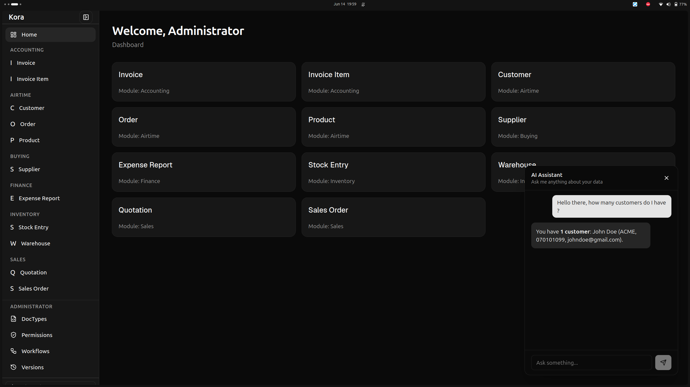
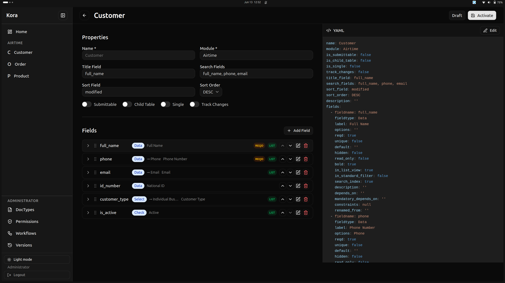
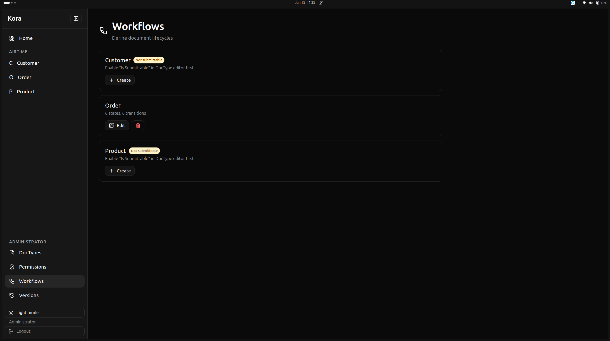
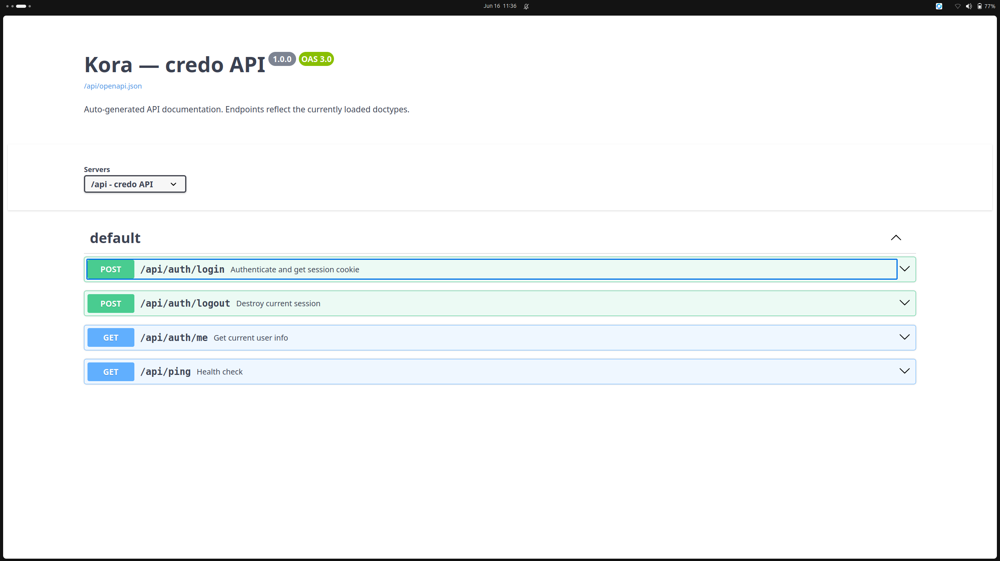

# Kora

**Describe your application in YAML. Get a database, API, and admin panel — automatically.**

[](https://hub.docker.com/r/smitdockerhub/kora)
[](https://github.com/asenawritescode/kora)

---

## Quick Start

```bash
docker run -d --name kora -p 8000:8000 \
  -e KORA_DB_TYPE=mysql \
  -e KORA_DB_HOST=127.0.0.1 \
  -e KORA_DB_USER=root \
  -e KORA_DB_PASSWORD=yourpassword \
  -e CONSOLE_EMAIL=admin@kora.local \
  -e CONSOLE_PASSWORD=admin123 \
  smitdockerhub/kora:latest
```

Open **http://localhost:8000/console** → create your first site. No code needed.

[Full setup guide →](SETUP.md)

---

## How It Works

```
You write this:                    Kora builds:

config/todo/                       ✅ MySQL / LibSQL database
  doctypes/todo.yaml               ✅ REST API (CRUD + auth)
  roles.yaml                       ✅ React admin panel
  permissions.yaml                 ✅ Forms, lists, filters
                                   ✅ Mobile responsive
```

Three YAML files. One binary. **Zero application code.**

---

## What It Looks Like

### Your Command Center



The workspace greets you with everything you need, right where you expect it. Your modules — Customers, Work Orders, Equipment — sit in the sidebar, always one click away. The AI chat assistant floats quietly in the corner, ready to create, find, or update records the moment you type what you need in plain English. No forms to hunt for, no menus to memorize. Just ask.

### Build Your Data Model Visually



Every piece of your application starts as a DocType — a Customer, an Invoice, a Work Order. The visual builder lets you drag fields into place, set validation rules, and watch a live YAML preview update in real time. You never write a CREATE TABLE statement. You never configure an ORM. You define what a Customer looks like, and Kora handles the database, the API, and the form — all at once.

### Automate Your Processes



Most apps need things to move — a Work Order goes from *Draft* to *In Progress* to *Completed*, an Invoice from *Unpaid* to *Paid*. The workflow editor lets you draw these paths as states and transitions. Add conditions ("only Managers can approve"), require specific fields, trigger email notifications on state changes. It's a state machine you design with clicks, not code.

### API Documentation That Writes Itself



Every DocType you create gets a full REST API — and every API gets live, interactive documentation. The Swagger UI shows you every endpoint, every parameter, every response shape. You can even call the API right from the docs to test it. No writing OpenAPI specs by hand. No stale documentation. Your API and its docs are always in sync because they come from the same source.

## What You Get

| Feature | How |
|---|---|
| **Database** | Tables created and migrated automatically (MySQL or LibSQL) |
| **REST API** | CRUD, authentication, permissions, CSRF, OpenAPI 3.0 spec |
| **Admin UI** | Config-driven forms, lists, searchable autocomplete, computed fields |
| **AI Chat** | Natural language CRUD — create, find, update records via chat |
| **Workflows** | State machines — Draft → Submitted → Approved |
| **Multi-site** | One server, many apps, separate databases per site |
| **User Management** | Site-scoped users, roles, password reset — all from the UI |
| **Single binary** | Go + React SPA embedded via go:embed, ~63MB |
| **Swagger UI** | Auto-generated API docs at `/api/swagger-ui` |

---

## What You Can Build

**[10 complete SaaS applications](USECASES.md) — all in YAML config, zero application code:**

| # | Application | Highlights |
|---|-------------|------------|
| 1 | **CRM** | Deal pipeline, computed totals, sales permissions |
| 2 | **Help Desk** | Ticket lifecycle, agent assignment, SLA tracking |
| 3 | **Project Management** | Task hierarchy, progress tracking, COUNT aggregation |
| 4 | **Inventory** | Real-time stock levels, warehouse movements |
| 5 | **Recruitment** | Job pipeline, candidate tracking, resume uploads |
| 6 | **Invoicing** | Line items, tax calculation, payment lifecycle |
| 7 | **Property Management** | Lease tracking, occupancy, DATEDIFF expiry |
| 8 | **LMS** | Course builder, enrollments, student tracking |
| 9 | **Event Management** | Registrations, capacity management, check-in |
| 10 | **Contract Management** | Obligations, renewals, DATEDIFF countdown |

Each comes with database, REST API, React admin panel, role-based permissions, and workflow automation — from 3-6 YAML files.

### Quick Example: Todo

```yaml
name: Todo
module: Tasks
title_field: title

fields:
  - fieldname: title
    fieldtype: Data
    reqd: true
  - fieldname: status
    fieldtype: Select
    options: |
      Pending
      In Progress
      Done
  - fieldname: due_date
    fieldtype: Date
```

---

## Documentation

- [**What You Can Build**](USECASES.md) — 10 SaaS applications with config examples
- [Setup Guide](SETUP.md) — Prerequisites, installation, multi-site, production
- [Configuration Reference](CONFIG.md) — DocTypes, fields, constraints, workflows
- [API Reference](API.md) — REST endpoints, auth, users, secrets, OpenAPI
- [Architecture](ARCHITECTURE.md) — Request flow, middleware, multi-tenancy, AI system
- [Decisions](DECISIONS.md) — Why React SPA, computed fields, path-based routing

---

## Docker

```
smitdockerhub/kora:latest
```

Supports MySQL and LibSQL. Pure Go, no CGO. ~63MB.

---

## License

AGPL-3.0 — Free software. Network use is distribution.

<p style="margin-top: 3rem; font-size: 0.85rem; color: #666">
  Built with Go, React, and conviction.
</p>
